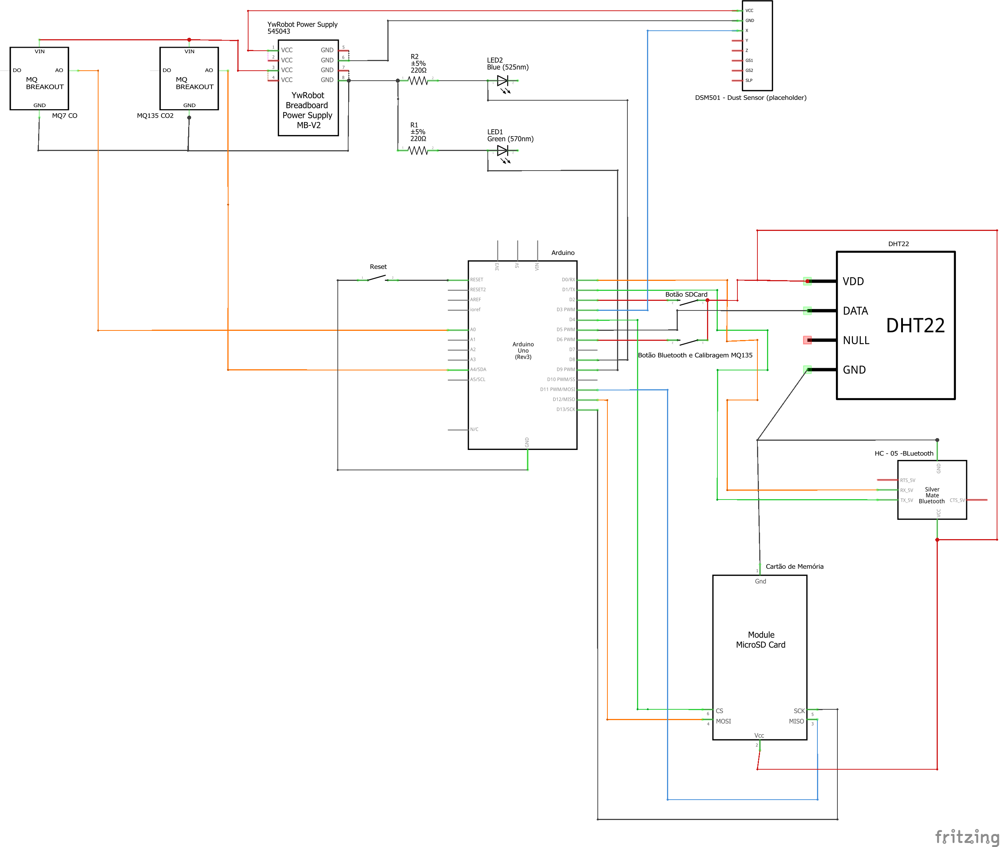

# ArQuality

## Componentes Utilizados:

| Quantidade | Componente |
|------------|------------|
|      1x    |Arduino UNO |
|      1x    |Placa Fenolite Perfurada|
|      1x    |Módulo de fonte  YwRobot|
|      3x    |Push Button |
|      1x    | LED Azul |
|      1x    | LED verde |
|      3x    | Borne De 3 Conectores  |
|      1x    | Módulo Bluetooth HC-06|
|      1x    | Módulo MicroSD Card|
|      1x    | Sensor MQ135|
|      1x    | Sensor MQ7|
|      1x    | Sensor DHT22|
|      1x    | Sensor DSM500A1|

## Bibliotecas 

- DHT
- MQ7
- MQ135
- SD
- Streaming

### DHT

Escrito por: Adafruit Industries

Biblioteca responsável por controlar sensores de temperatura e umidade de baixo custo da serie DHT.

### MQ7

Escrito por: Swatish Swaminatham

Responsável por obter a concentração de CO em ppm. A biblioteca converte a entrada analógica do sensor para a medida em ppm.

### MQ135

Escrito por: GeorgK

Responsável por obter a concentração de CO2 em ppm. A biblioteca converter a entrada analógica do sensor para a medida em ppm.

Biblioteca modificada para que fosse possível aplicar a calibragem do sensor por meio de um botão, sem a necessidade de um novo upload de código.

### SD
Escrito por: Adafruit Industries

Simples biblioteca para a criação e gravação e dados em catão microSD.

### Streaming

Permite a utilização da concatenação para a utilização do print de múltiplos valores no arduino, melhorando a leitura e entendimento do código.

## Esquemático

